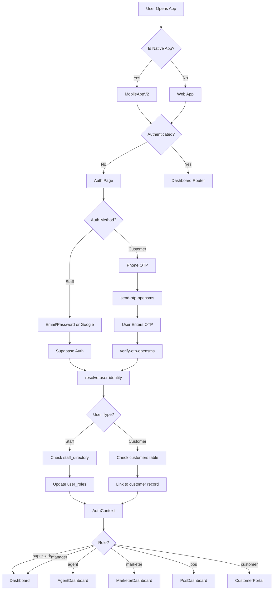
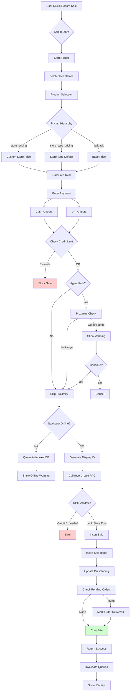
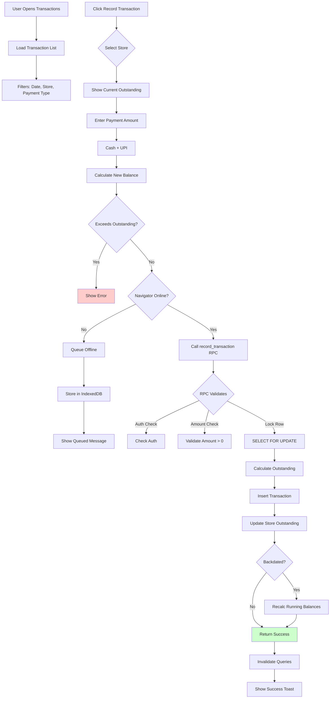
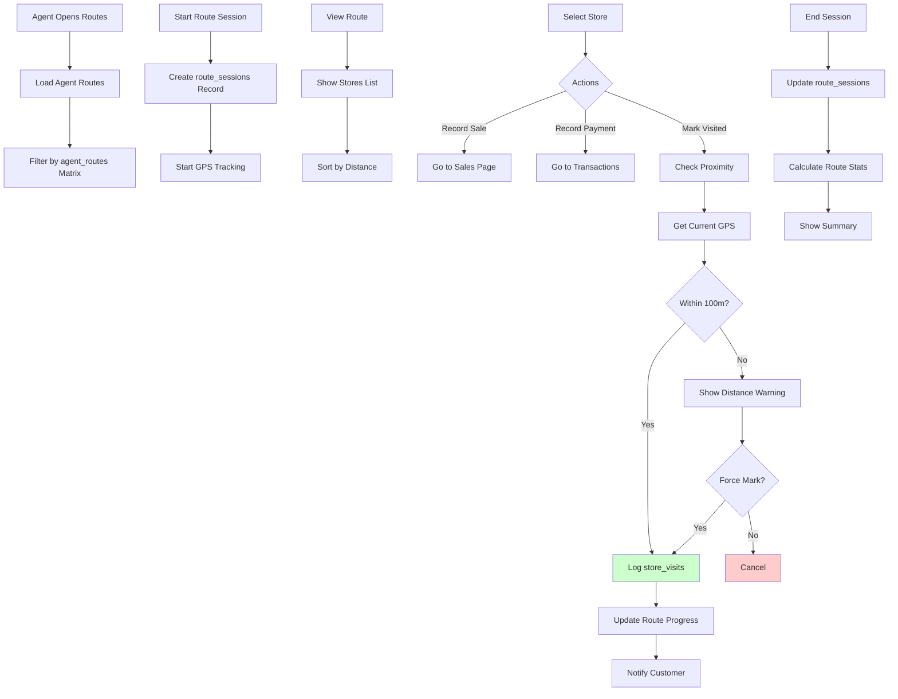
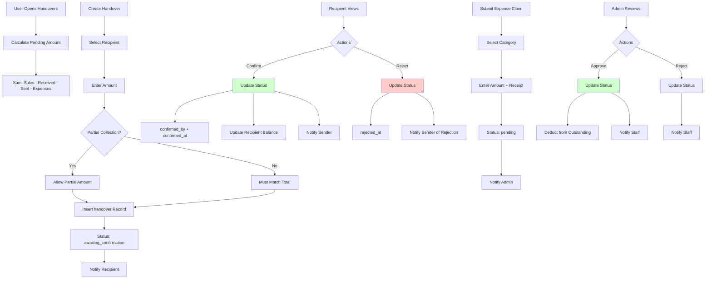
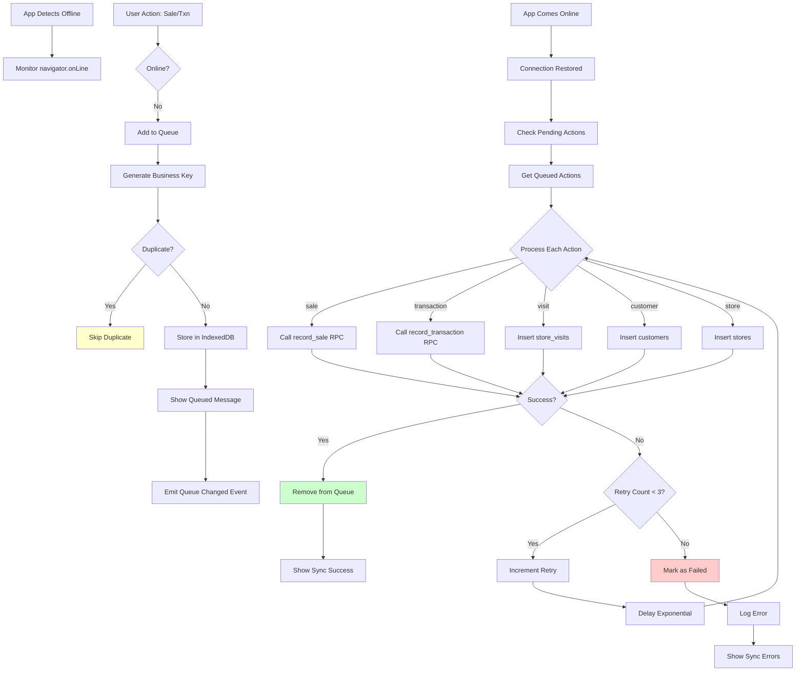
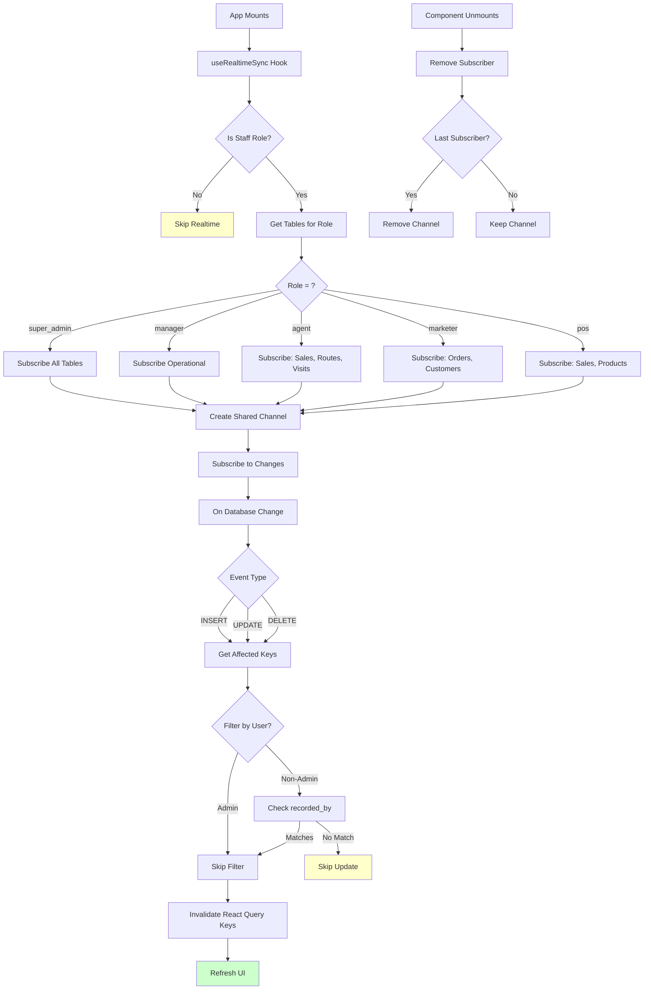
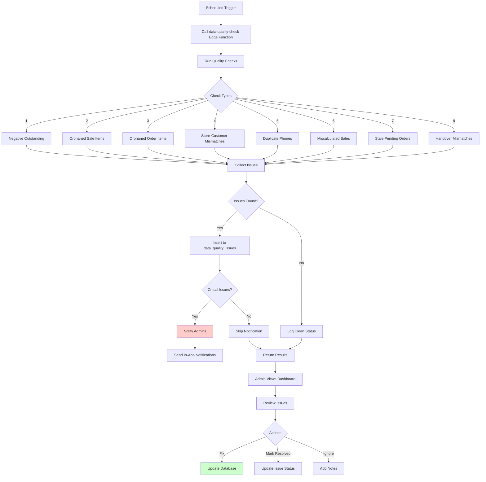
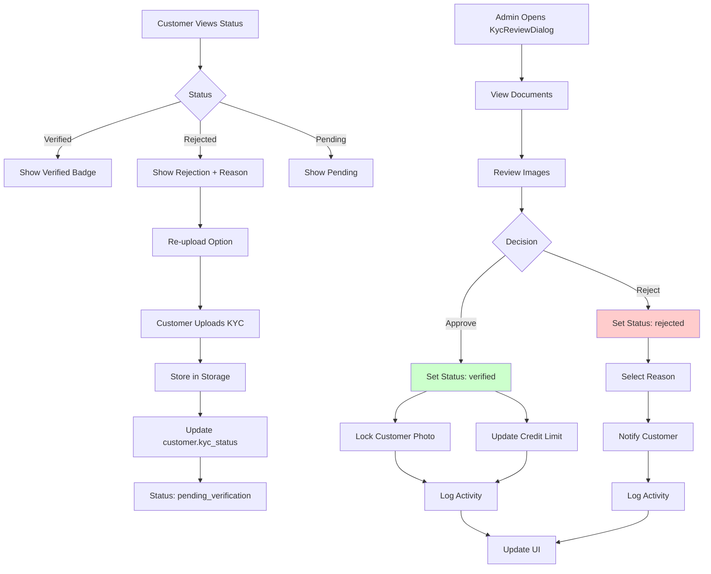

# BizManager Application Flowcharts

Visual representation of key application flows.

---

## 1. Authentication Flow



---

## 2. Sales Recording Flow



---

## 3. Transaction/Payment Flow



---

## 4. Order Management Flow

```mermaid
flowchart TD
    A[User Opens Orders] --> B[Load Order List]
    B --> C[Filter: Status, Date Range]
    
    D[Create New Order] --> E{Select Customer}
    E --> F{Select Store}
    F --> G{Order Type?}
    
    G -->|Simple| H[Enter Requirement Note]
    G -->|Detailed| I[Select Products + Qty]
    
    H --> J[Credit Limit Check]
    I --> J
    
    J --> K{RPC check_store_credit_limit}
    K -->|Exceeds Limit| L[Block Order]
    K -->|Warning (>80%)| M[Show Warning]
    K -->|OK| N[Proceed]
    
    M --> O{Continue?}
    O -->|No| P[Cancel]
    O -->|Yes| N
    
    N --> Q[Generate ORD-XXXXXX]
    Q --> R[Insert Order Record]
    R --> S{Detailed?}
    
    S -->|Yes| T[Insert Order Items]
    S -->|No| U[Notify Admins]
    T --> U
    
    U --> V[Invalidate Queries]
    
    W[View Pending Order] --> X{Actions}
    X -->|Fulfill| Y[OrderFulfillmentDialog]
    X -->|Cancel| Z[Show Reason Dialog]
    
    Y --> AA[Create Sale from Order]
    AA --> AB[record_sale RPC]
    AB --> AC[Link sale to order]
    AC --> AD[Update Order Status]
    
    Z --> AE[Select Reason]
    AE --> AF[Update Status to Cancelled]
    AF --> AG[Notify Customer]
    
    style L fill:#ffcccc
    style AD fill:#ccffcc
    style AG fill:#ccffcc
```

---

## 5. Route/Agent Session Flow



---

## 6. Handover (Cash/UPI Collection) Flow



---

## 7. Offline Sync Flow



---

## 8. Real-time Sync Flow



---

## 9. Data Quality Check Flow



---

## 10. KYC Verification Flow



---

## Legend

| Symbol | Meaning |
|--------|---------|
| 🟢 | Success/Complete |
| 🔴 | Error/Blocked |
| 🟡 | Warning/Caution |
| 🔵 | Process/Action |
| ⚪ | Decision Point |

---

*Flowcharts generated: 2026-04-12*
