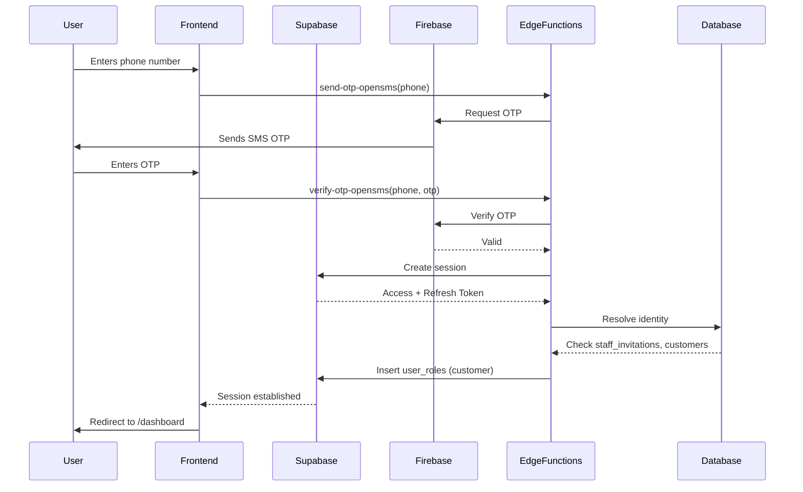

# PRD Phase 3: Authentication & Identity Flow

## Hybrid Authentication System

The system uses a dual authentication model:

| User Type | Authentication Method | Token Exchange | Role Assignment |
|-----------|------------------------|----------------|-----------------|
| Staff (`super_admin`, `manager`, `agent`, `marketer`, `pos`) | Supabase email/password | None | Assigned via `invite-staff` edge function |
| Customer | Firebase Phone OTP | Supabase JWT exchange | Automatically assigned as `customer` |

> **Security Note**: All authentication flows are server-enforced. Client-side logic only triggers flows; permissions and role assignment occur only after server validation.

## Staff Authentication Flow

### 1. Invitation
- Admin initiates invitation via `invite-staff` edge function
- Email and/or phone number provided
- System creates a Supabase user with `email` and `password` (if email provided)
- System creates a `staff_directory` entry with `role`, `full_name`, `phone`, `email`
- System creates record in `staff_invitations` table with `status: pending`

### 2. Registration
- User receives email with password reset link
- User clicks link → redirected to `/reset-password` with token
- User sets password → Supabase authenticates and creates session
- System checks `staff_invitations` → updates `status: accepted`
- System inserts into `user_roles` table with assigned role
- User is now authenticated as staff

### 3. Role Enforcement
- Role stored in `user_roles` table
- `auth.uid()` used to validate identity
- `useAuth()` hook in `AuthContext.tsx` fetches role from `user_roles`
- Default fallback: `customer` if no role assigned
- `invite-staff` function enforces `super_admin` only can invite staff

## Customer Authentication Flow

### 1. OTP Initiation
- User enters phone number on `/auth` page
- `send-otp-opensms` edge function sent to Firebase
- Firebase sends SMS with 6-digit OTP

### 2. OTP Verification
- User enters OTP
- `verify-otp-opensms` edge function validates OTP against Firebase session
- On success, returns:
  - `access_token`
  - `refresh_token`
  - `session_token`
  - `user` object (with phone)

### 3. Supabase Token Exchange
- Client calls `supabase.auth.setSession({ access_token, refresh_token })`
- Supabase creates new session with `user_id` tied to phone
- System resolves identity via `firebase-phone-exchange` edge function:
  - Checks `staff_invitations` for pending staff invite → if found, assigns staff role
  - Checks `customers` table for existing customer with same phone → if found, logs in as existing customer
  - If no match → creates new `customers` record with `user_id = auth.uid()`
  - Inserts `user_roles` record with `role: customer`
  - Updates `profiles` table with `onboarding_complete: true`

### 4. Self-Registration
- RLS policy `customer_self_register_rls.sql` allows:
  - `INSERT` into `customers` where `user_id = auth.uid()`
  - `INSERT` into `stores` where `customer_id` belongs to `user_id = auth.uid()`
- Customer can self-register without admin intervention
- Customer can upload KYC documents via `kyc-documents` storage bucket
- KYC status (`approved`, `pending`, `rejected`) controls credit limit

## Authentication Flow Diagram

## Key Implementation Details

### Supabase Client
- Initialized in `src/integrations/supabase/client.ts`
- Uses `VITE_SUPABASE_URL` and `VITE_SUPABASE_PUBLISHABLE_KEY` from `env.ts`
- `auth.storage = localStorage` → persistent session
- `autoRefreshToken: true` → handles token expiry automatically

### Firebase Integration
- Configured via `.env.example`:
  - `VITE_FIREBASE_API_KEY`
  - `VITE_FIREBASE_AUTH_DOMAIN`
  - `VITE_FIREBASE_PROJECT_ID`
  - `VITE_FIREBASE_APP_ID`
- Phone OTP handled by Firebase Auth
- No Firebase SDK used in frontend; all interaction via edge functions

### Edge Functions
- `send-otp-opensms`: Triggers SMS via OpenSMS API
- `verify-otp-opensms`: Validates OTP and exchanges for Supabase JWT
- `firebase-phone-exchange`: Resolves identity and assigns role
- `invite-staff`: Creates staff account, sends password reset

### Security Policies
- All edge functions use `verify_jwt: true` → only authenticated users can call
- `invite-staff` requires `role: super_admin`
- `firebase-phone-exchange` validates token signature and phone ownership
- RLS policies enforce:
  - `customers.user_id = auth.uid()`
  - `stores.customer_id IN (SELECT id FROM customers WHERE user_id = auth.uid())`
- No secrets exposed in client bundle

### Identity Resolution
- Phone number is the primary key for identity linkage
- `significantPhone()` function normalizes phone to 10-digit format
- Identity resolution happens in `firebase-phone-exchange`:
  - If phone matches `staff_invitations` → assign staff role
  - If phone matches `customers` → log in as existing customer
  - Else → create new customer
- No duplicate customers allowed by phone number

### Session Management
- `AuthContext.tsx` uses `supabase.auth.onAuthStateChange()` to sync session state
- On session change:
  - Fetches `user_roles`, `profiles`, `customers`
  - Sets `role`, `profile`, `customer` in context
  - Uses `customer` object for display name and contact info
- Session persists across app reloads via localStorage

### Error Handling
- Invalid OTP → user prompted to retry
- Phone already registered as staff → redirect to login with message
- Duplicate customer → auto-login existing account
- No internet → retry on reconnect
- Expired session → auto-renew via `autoRefreshToken: true`

## Key Conventions

- **Never hardcode** authentication logic in frontend
- All role assignment occurs server-side via `user_roles` table
- Phone number is the anchor for customer identity
- Use `useAuth()` hook to access `role`, `user`, `profile`, `customer` in components
- Use `usePermission(...)` for access checks, never `role === 'customer'`
- All edge functions use `verify_jwt: true` for security
- Never store secrets in `.env` or frontend code
- Use `VITE_*` variables only for public keys
- Supabase Service Role Key never exposed to client

---
**Next Phase**: Phase 4 — Data Models & RLS Policies